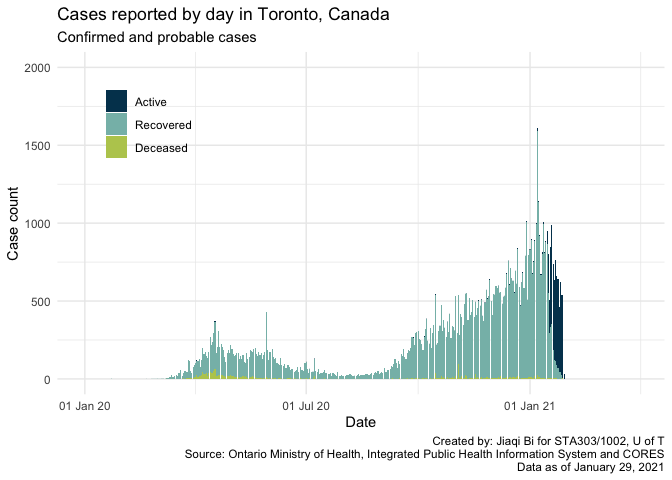
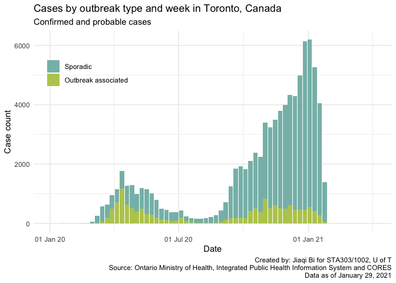
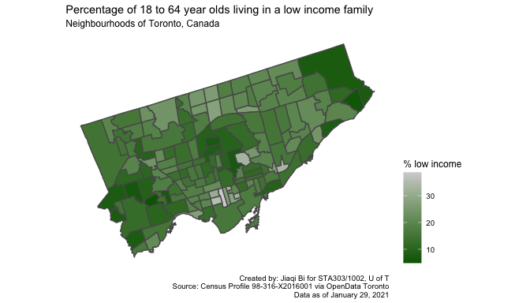
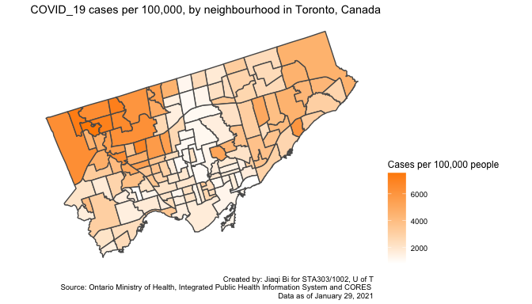
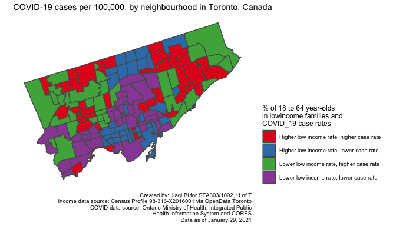

Code last run 2021-03-30.  
Daily: Data as of January 29, 2021.  
Neighbourhood: Data as of January 28, 2021.

# Task 1: Daily cases

## Data wrangling

``` r
#Replace all NAs with 0 in all columns, capitalize to appropriate names
reported <- reported_raw %>%
  mutate_if(is.numeric, replace_na, replace=0) %>%
  mutate(reported_date = date(reported_date)) %>%
  rename(
    Reported_Date = reported_date,
    Recovered = recovered, 
    Active = active, 
    Deceased = deceased
  ) %>%
  pivot_longer(-c(Reported_Date),
             names_to="Case", values_to="Count") %>%
  mutate(Case = fct_relevel(Case, "Deceased", after = 3))
```

## Data visualization

``` r
# Task 1 Data Visualization
reported %>%
  ggplot(aes(x=Reported_Date, y=Count, fill = Case)) +
  geom_bar(stat="identity") +
  theme_minimal() +
  labs(title="Cases reported by day in Toronto, Canada",
       subtitle="Confirmed and probable cases",
       x = "Date",
       y = "Case count",
       caption = str_c(
         "Created by: Jiaqi Bi for STA303/1002, U of T\n",
         "Source: Ontario Ministry of Health, Integrated Public Health Information System and CORES\n", 
         date_daily[1,1])) +
  scale_x_date(labels = scales::date_format("%d %b %y"), 
               limits = c(date("2020-01-01"), Sys.Date())) +
  scale_y_continuous(limits = c(0, 2000)) +
  theme(legend.title = element_blank(), legend.position = c(0.15, 0.8)) +
  scale_fill_manual(values = c("#003F5C", "#86BCB6", "#B9CA5D"))
```

<!-- -->

# Task 2: Outbreak type

## Data wrangling

``` r
outbreak <- outbreak_raw %>%
  mutate(episode_week = date(episode_week)) %>%
  rename(
    Outbreak_or_Sporadic = outbreak_or_sporadic,
    Episode_Week = episode_week, 
    Cases = cases
  ) %>%
  mutate(Outbreak_or_Sporadic = str_replace(Outbreak_or_Sporadic, "OB Associated",
                                            "Outbreak associated")) %>%
  mutate(Outbreak_or_Sporadic = fct_rev(Outbreak_or_Sporadic)) 

create_total_cases <- summarise(group_by(outbreak, Episode_Week), 
                               total_cases = sum(Cases))
outbreak <- left_join(outbreak, create_total_cases) 
```

## Data visualization

``` r
outbreak %>%
  ggplot(aes(x=Episode_Week, y=Cases, fill=Outbreak_or_Sporadic)) +
  geom_bar(stat = "identity") +
  theme_minimal() +
  labs(title = "Cases by outbreak type and week in Toronto, Canada",
       subtitle = "Confirmed and probable cases",
       x = "Date", 
       y = "Case count", 
       caption =  str_c(
         "Created by: Jiaqi Bi for STA303/1002, U of T\n",
         "Source: Ontario Ministry of Health, Integrated Public Health Information System and CORES\n", 
         date_daily[1,1])) +
  scale_x_date(labels = scales::date_format("%d %b %y"), limits = c(date("2020-01-01"),
                                                                    Sys.Date()+7)) +
  scale_y_continuous(limits = c(0, max(outbreak$total_cases))) +
  theme(legend.title = element_blank(), legend.position = c(0.15, 0.8)) +
  scale_fill_manual(values = c("#86BCB6", "#B9CA5D"))
```

<!-- -->

# Task 3: Neighbourhoods

## Data wrangling: part 1

``` r
income <- nbhood_profile %>%
  filter(`_id` == 1143) %>%
  pivot_longer(-c(`_id`, Category, Topic, `Data Source`, Characteristic), 
               names_to="neighbourhood_name", values_to="percentage") %>%
  select(-c(`_id`, Category, Topic, `Data Source`, Characteristic)) %>%
  mutate(percentage = parse_number(percentage))
```

## Data wrangling: part 2

``` r
nbhoods_all <- nbhoods_shape_raw %>%
  mutate(neighbourhood_name = str_remove(AREA_NAME, "\\s\\(\\d+\\)$")) %>%
  mutate(neighbourhood_name = str_replace(neighbourhood_name, "St.James", "St. James")) %>%
  mutate(neighbourhood_name = str_replace(neighbourhood_name, "Weston-Pellam", "Weston-Pelham")) %>%
  full_join(nbhood_raw, by = "neighbourhood_name") %>%
  full_join(income, by = "neighbourhood_name") %>%
  select(-c(neighbourhood_id, case_count)) %>% 
  filter(!is.na(rate_per_100_000_people)) %>%
  rename(rate_per_100000 = rate_per_100_000_people)
```

## Data wrangling: part 3

``` r
nbhoods_final <- nbhoods_all %>%
  mutate(med_inc = median(percentage)) %>%
  mutate(med_rate = median(rate_per_100000)) %>%
  mutate(nbhood_type = case_when(
    percentage >= med_inc & rate_per_100000 >= med_rate
    ~ "Higher low income rate, higher case rate", 
    percentage >= med_inc & rate_per_100000 < med_rate
    ~ "Higher low income rate, lower case rate", 
    percentage < med_inc & rate_per_100000 >= med_rate
    ~ "Lower low income rate, higher case rate", 
    percentage < med_inc & rate_per_100000 < med_rate
    ~ "Lower low income rate, lower case rate"
  ))
```

## Data visualization

``` r
ggplot(data = nbhoods_final) +
  geom_sf(aes(fill = percentage)) +
  theme_map() +
  theme(legend.position = "right") + 
  scale_fill_gradient(name = "% low income", low = "darkgreen", high = "lightgrey") +
  labs(title = "Percentage of 18 to 64 year olds living in a low income family", 
       subtitle = "Neighbourhoods of Toronto, Canada",
       caption =  str_c(
         "Created by: Jiaqi Bi for STA303/1002, U of T\n",
         "Source: Census Profile 98-316-X2016001 via OpenData Toronto\n",
         date_daily[1,1]))
```

<!-- -->

``` r
ggplot(data = nbhoods_final) +
  geom_sf(aes(fill = rate_per_100000)) +
  theme_map() +
  theme(legend.position = "right") +
  scale_fill_gradient(name = "Cases per 100,000 people", low = "white", high = "darkorange") +
  labs(title = "COVID_19 cases per 100,000, by neighbourhood in Toronto, Canada", 
       caption =  str_c(
         "Created by: Jiaqi Bi for STA303/1002, U of T\n",
         "Source: Ontario Ministry of Health, Integrated Public Health Information System and CORES \n", 
         date_daily[1,1]
       ))
```

<!-- -->

``` r
ggplot(data = nbhoods_final) +
  geom_sf(aes(fill = nbhood_type)) +
  theme_map() +
  theme(legend.position = "right") +
  scale_fill_brewer(palette = "Set1", name = str_c("% of 18 to 64 year-olds\n",
                                                   "in lowincome families and\n",
                                                   "COVID_19 case rates")) +
  labs(title = "COVID-19 cases per 100,000, by neighbourhood in Toronto, Canada", 
       caption =  str_c(
      "Created by: Jiaqi Bi for STA303/1002, U of T\n",
      "Income data source: Census Profile 98-316-X2016001 via OpenData Toronto\n",
      "COVID data source: Ontario Ministry of Health, Integrated Public\n", 
      "Health Information System and CORES\n", 
      date_daily[1,1]
       ))
```

<!-- -->
